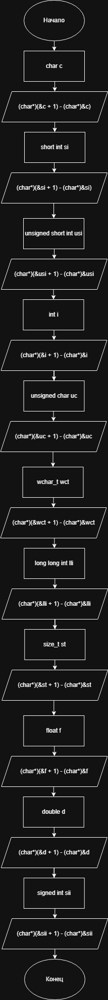

# Домашнее задание к работе 12

## Условие задачи
Напишите программу, которая вычисляет размер основных типов данных в байтах:
1) char
2) short int
3) unsigned short int
4) int
5) unsigned char
6) wchar_t
7) long long int
8) size_t
9) float
10) double
11) signed int
---
## 1. Алгоритм и блок схема

### Алгоритм
1. **Начало**
2. Объявляем переменные.
3. Вычисляем размер типа данных с помощью разницы адресов в char(байтах) между переменной и следуещей после неё.
4. Выводим результат и повторяем для всех требуемых типов данных.
9. **Конец**

### Блок-схема


 [Ссылка на блок-схему](https://viewer.diagrams.net/?tags=%7B%7D&lightbox=1&highlight=0000ff&edit=_blank&layers=1&nav=1&title=Lab12_schema.drawio&dark=auto#Uhttps%3A%2F%2Fdrive.google.com%2Fuc%3Fid%3D1_B6BQWiHzThq-Lu3g2qHFW9FfzkGgVsY%26export%3Ddownload)

 ## 2. Реализация программы

```c
#include <locale.h>
#include <stdio.h>

int main() {

	setlocale(LC_ALL, "RUS");

	char c;
	printf("Размер char = %d бaйтов\n", (char*)(&c + 1) - (char*)&c);

	short int si;
	printf("Размер short int = %d бaйтов\n", (char*)(&si + 1) - (char*)&si);

	unsigned short int usi;
	printf("Размер unsigned short int = %d бaйтов\n", (char*)(&usi + 1) - (char*)&usi);

	int i;
	printf("Размер int = %d бaйтов\n", (char*)(&i + 1) - (char*)&i);

	unsigned char uc;
	printf("Размер unsigned char = %d бaйтов\n", (char*)(&uc + 1) - (char*)&uc);

	wchar_t wct;
	printf("Размер wchar_t = %d бaйтов\n", (char*)(&wct + 1) - (char*)&wct);

	long long int lli;
	printf("Размер long long int = %d бaйтов\n", (char*)(&lli + 1) - (char*)&lli);

	size_t st;
	printf("Размер size_t = %d бaйтов\n", (char*)(&st + 1) - (char*)&st);

	float f;
	printf("Размер float = %d байтов\n", (char*)(&f + 1) - (char*)&f);

	double d;
	printf("Размер double = %d байтов\n", (char*)(&d + 1) - (char*)&d);

	signed int sii;
	printf("Размер signed int = %d байтов\n", (char*)(&sii + 1) - (char*)&sii);

	system("pause");
}
```
# 3. Результаты работы программы
<br>Размер char = 1 бaйтов
<br>Размер short int = 2 бaйтов
<br>Размер unsigned short int = 2 бaйтов
<br>Размер int = 4 бaйтов
<br>Размер unsigned char = 1 бaйтов
<br>Размер wchar_t = 2 бaйтов
<br>Размер long long int = 8 бaйтов
<br>Размер size_t = 8 бaйтов
<br>Размер float = 4 байтов
# 4. Информация о разработчике
Авраменко Дмитрий бИПТ-251
Размер double = 8 байтов
Размер signed int = 4 байтов
Для продолжения нажмите любую клавишу . . .
